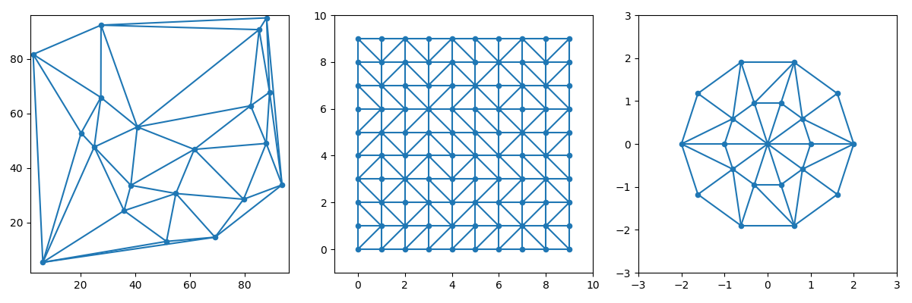

# ドロネー三角形分割の期待最速アルゴリズム

ドロネー三角形分割を期待計算量 O(n log n) で行うアルゴリズムの C++ による実装です。

## 使用例

```c++
#include "../delaunay_triangulation.hpp"
...
std::vector<double> x(n), y(n);
...
delaunay::DelaunayTriangulation DT(x, y); // (std::vector<double> x, std::vector<double> y, uint32_t seed_)
DT.execute(); // (double min_delta = 1e-5, double max_delta = 1e-2, int max_miss_count = 30)
DT.dump(std::cout);
```

本実装では、同一直線上に 3 つ以上の点が存在していた場合に、処理の都合で一時的に点の座標を微小にランダム摂動する場合があります。その範囲を `min_delta, max_delta` で指定します。なお `max_miss_count` 回ランダム摂動しても不都合であった場合は、その点は無視されます。

## 適用例



## 参考資料
* [MITのレクチャーノート（スライド版）](http://web.mit.edu/alexmv/Public/6.850-lectures/lecture09.pdf)
* [MITのレクチャーノート（原稿版）](http://www.cs.uu.nl/geobook/interpolation.pdf)

## ライセンス

The MIT License (MIT)

Copyright (c) 2019 Hirofumi Suzuki

Permission is hereby granted, free of charge, to any person obtaining a copy of this software and associated documentation files (the "Software"), to deal in the Software without restriction, including without limitation the rights to use, copy, modify, merge, publish, distribute, sublicense, and/or sell copies of the Software, and to permit persons to whom the Software is furnished to do so, subject to the following conditions:

The above copyright notice and this permission notice shall be included in all copies or substantial portions of the Software.

THE SOFTWARE IS PROVIDED "AS IS", WITHOUT WARRANTY OF ANY KIND, EXPRESS OR IMPLIED, INCLUDING BUT NOT LIMITED TO THE WARRANTIES OF MERCHANTABILITY, FITNESS FOR A PARTICULAR PURPOSE AND NONINFRINGEMENT. IN NO EVENT SHALL THE AUTHORS OR COPYRIGHT HOLDERS BE LIABLE FOR ANY CLAIM, DAMAGES OR OTHER LIABILITY, WHETHER IN AN ACTION OF CONTRACT, TORT OR OTHERWISE, ARISING FROM, OUT OF OR IN CONNECTION WITH THE SOFTWARE OR THE USE OR OTHER DEALINGS IN THE SOFTWARE.
